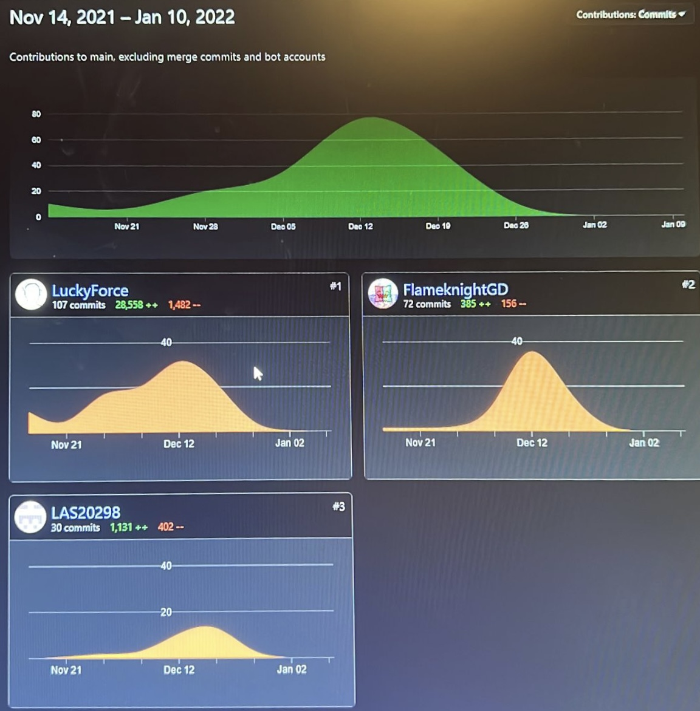

# Logic-Riddle
<h2>POS Logic Project</h2>

<h5>Github Repository:</h5>
https://github.com/LuckyForce/Logic-Riddle/  

<h5>Division of labour in topics:</h5>
Schauer (52%): API, Frontend (JS handling of logic and fetch).  
Lasser (38%): Frontend (Everything that had to do with looks), integration of Canvas Confetti.  
Sam (10%): Database initialization Script and JS Frontend Validations.  

<h5>Statistic from 10th January 2022</h5>

<h5>Description:</h5>
On our page you can calculate logic expressions, or make an account and create or solve logic riddles.
